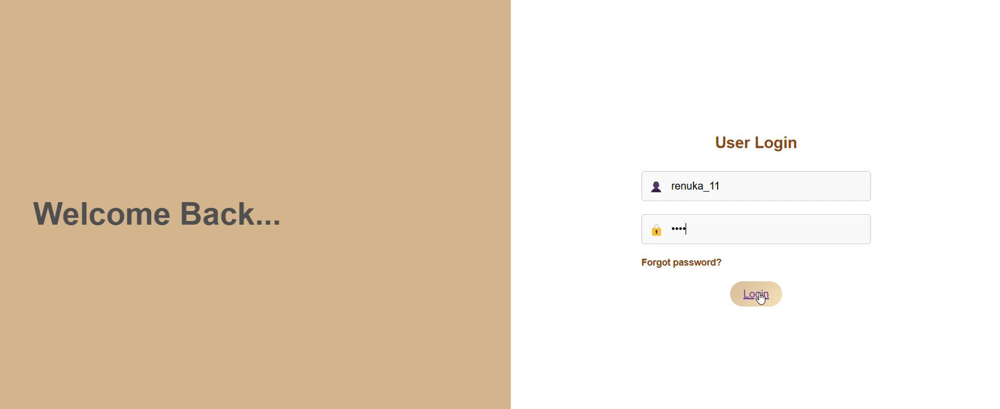

Placement Query Chatbot
The Placement Query Chatbot is a lightweight, interactive chatbot designed to assist students with their placement-related queries. It aims to streamline the process of getting answers to frequently asked questions about placements, making it easier for students to prepare and understand the placement process.

🌟 Features
Dynamic Responses: Provides quick, accurate answers to predefined questions.
Easy Customization: Modify or add queries and responses using a JSON file.
Responsive Design: Optimized for use across devices (desktop and mobile).
User-Friendly Interface: Clean and minimalistic UI for effortless interaction.
🛠️ Technologies Used
HTML: To structure the web pages.
CSS: For styling and ensuring the chatbot looks visually appealing.
JavaScript: Implements the chatbot's functionality and handles user interactions.
JSON: Stores the question-answer pairs for easy configuration and updates.
📂 Project Structure
Here’s an overview of the files included in the project:

bash
Copy
Edit
placement-chatbot/
│
├── index.html        # The main entry point of the chatbot
├── style.css         # Stylesheet for designing the chatbot interface
├── script.js         # JavaScript file implementing chatbot logic
└── data.json         # JSON file containing question-answer pairs
File Details
index.html

Contains the chatbot's structure and layout.
Links to style.css for styling and script.js for functionality.
style.css

Defines the look and feel of the chatbot.
Includes styling for the chatbot box, input field, and buttons.
script.js

Implements the logic for user input handling and response generation.
Fetches data from the data.json file and matches user queries with answers.
data.json

Stores predefined questions and answers in a structured format.
Easily editable to add or update queries.
🚀 How to Run the Project
Clone the repository:
bash
Copy
Edit
git clone https://github.com/yourusername/placement-chatbot.git
Navigate to the project directory:
bash
Copy
Edit
cd placement-chatbot
Open the index.html file in any modern web browser.
✨ Customization Guide
You can customize the chatbot's responses by editing the data.json file. Follow these steps:

Open the data.json file in a text editor.
Add new question-answer pairs in the following format:
json
Copy
Edit
{
    "questions": [
        {
            "question": " What are the companies?",
            "answer": "The companies are: Company Tata, Company Amazon, Company TCS, Company Infosys."
        },
        {
            "question": "How many students were placed in Company Tata?",
            "answer": " 2 students were placed in Company Tata.."
        }
    ]
}
Save the file and refresh the webpage to see the updated chatbot.
📸 Screenshots
login page:

Chat Flow:

A conversation demonstrating its functionality.

🎯 Future Enhancements
Add natural language processing (NLP) for better query matching.
Implement a backend to log user queries for analysis.
Introduce voice-to-text functionality for hands-free interaction.
🤝 Contributing
Contributions are welcome!

Fork the repository and submit a pull request with improvements or new features.
Report any issues or bugs in the Issues section of this repository.
📜 License
This project is open-source and available under the MIT License.

